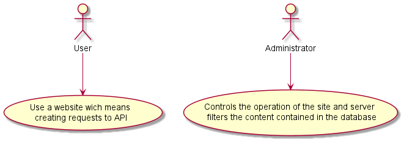
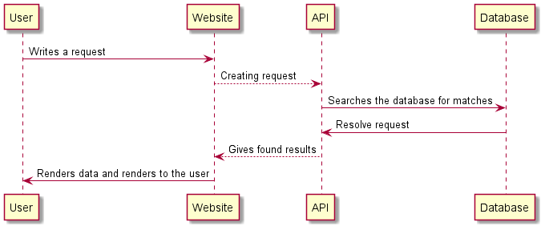
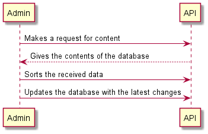

## 2. Сценарії

**Відношення узагальнення**

**Варіант використання**

### 2.1 Запит до API

**ID**: SС1.1  
**НАЗВА**: Пошук відео / статті.  
**УЧАСНИКИ**: Користувач, сайт, API, база даних.  
**ПЕРЕДУМОВИ**: Нема.

**РЕЗУЛЬТАТ**: Рендер отриманих від API даних і відображення на сайті.  
**ВИКЛЮЧНІ СИТУАЦІЇ**:
1. Співпадінь не знайдено.

**ОСНОВНИЙ СЦЕНАРІЙ**:
1. Користувач вводить назву відео або статті.
2. Система робить запит до бази даних.
3. Отримані результати відображаються на сайті.

**ДІАГРАМА**:

### 2.2 Сценарій роботи адміністратора з базою даних

**ID**: SС1.2  
**НАЗВА**: Авторизація користувача.  
**УЧАСНИКИ**: Адміністратор; API.   
**ПЕРЕДУМОВИ**: Відсутні

**РЕЗУЛЬТАТ**: Оновлення бази даних до актуального стану
**ВИКЛЮЧНІ СИТУАЦІЇ**:
1. Помилка сервера.

**ОСНОВНИЙ СЦЕНАРІЙ**:
1. Адміністратор запускає скрипт пошуку контенту по відомим джерелам.
2. Отриманий контент фільтрується і завантажується в базу даних відповідно до своєї теми / моделі.

**ДІАГРАМА:**

